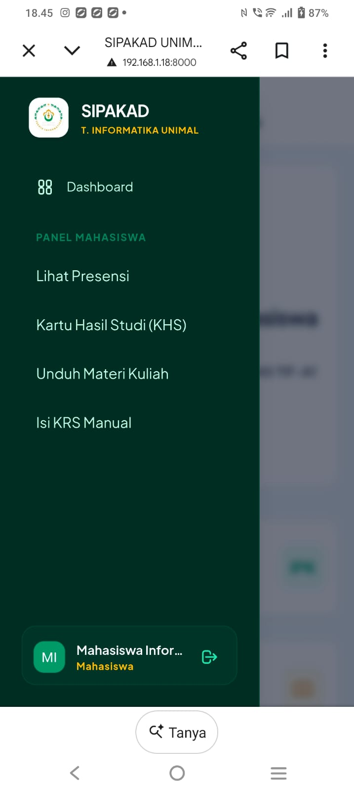

# SIPAKAD - Sistem Informasi Portal Akademik Terpadu

**SIPAKAD** adalah aplikasi web berbasis Laravel yang dirancang untuk mengelola aktivitas akademik Program Studi Teknik Informatika Universitas Malikussaleh, mencakup manajemen data master, perkuliahan, absensi, pengisian KRS, KHS, hingga unduh materi perkuliahan.

---

## Identitas Mahasiswa
* **Nama:** Naufal Gusliandi
* **NIM:** 230170161
* **Program Studi:** Teknik Informatika
* **Mata Kuliah:** Pemrograman Web Lanjut (A8)

---

## Fitur Utama & Kriteria UAS
1. **Autentikasi Pengguna:** Login, Registrasi, dan Verifikasi Email / Google Login.
- **Login**
.png)
.jpg)

- **Registrasi**
.png)
.jpg)

- **Verifikasi Email
.png)
.jpg)

2. **Hak Akses Berbasis Role (Multi-Role):**
   * **Admin:** Pengelolaan Master Data (Mahasiswa, Dosen, Mata Kuliah, Kelas, Ruangan, Jadwal Kuliah).
   .png)
   .jpg)

   * **Dosen:** Pengelolaan Absensi, Input Nilai, dan Upload Materi Kuliah.
   .png)
   .jpg)

   * **Mahasiswa:** Akses Presensi, KHS, Unduh Materi, dan Pengisian KRS Manual.
   .jpg)
   

3. **CRUD Lengkap:** Olah data penuh pada seluruh entitas akademik.
4. **Dashboard Statistik:** Ringkasan statistik realtime untuk setiap role.
**Dashboard Admin**
.jpg)
.png)

**Dashboard Dosen**
.jpg)
.png)

**Dashboard Mahasiswa**
.jpg)
.png)

5. **Export Laporan:** Fitur cetak/ekspor dokumen resmi akademik (KRS / KHS / Laporan) ke format PDF / Excel.
**KHS**
.jpg)
.png)
.png)
.jpg)

**KRS**
.png)
.jpg)
.png)
.png)

**Data Mahasiswa**
.png)
.jpg)
.png)
.jpg)

6. **Responsive Web Design:** Tampilan adaptif dan nyaman diakses melalui perangkat Desktop maupun Mobile (HP).
** 
7. **REST API:** Endpoint API terproteksi beserta dokumentasi pengujian Postman.

---

## 🔑 Akun Demo
| Role | Email | Password |
| :--- | :--- | :--- |
| **Admin** | `admin@unimal.ac.id` | `password123` |
| **Dosen** | `dosen@unimal.ac.id` | `password123` |
| **Mahasiswa** | `mahasiswa@mhs.unimal.ac.id` | `password123` |

---

## 🛠️ Cara Instalasi & Menjalankan Proyek

### 1. Clone Repository
```bash
git clone [https://github.com/Naufalgusliandi/sipakad-tif-unimal](https://github.com/Naufalgusliandi/sipakad-tif-unimal)
cd sipakad