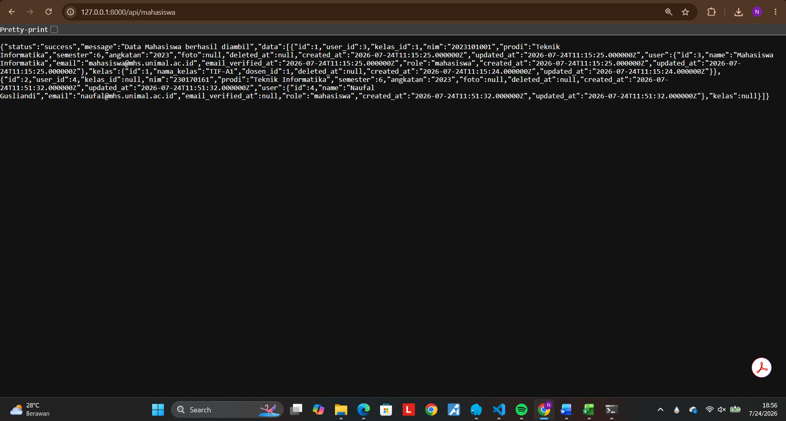

# 🎓 SIPAKAD - Sistem Informasi Portal Akademik Terpadu

**SIPAKAD** adalah aplikasi web berbasis framework Laravel yang dirancang untuk mengelola seluruh aktivitas akademik di lingkungan Program Studi Teknik Informatika Universitas Malikussaleh. Aplikasi ini menyediakan layanan pengelolaan data master akademik, jadwal perkuliahan, presensi, pengisian KRS, rekapitulasi KHS, hingga manajemen materi perkuliahan secara terintegrasi.

---

## 👨‍💻 Identitas Mahasiswa
* **Nama:** Naufal Gusliandi
* **NIM:** 230170161
* **Program Studi:** Teknik Informatika
* **Mata Kuliah:** Pemrograman Web Lanjut (A8)

---

## 🚀 Fitur Utama & Kriteria UAS
1. **Autentikasi Pengguna:** Login, Registrasi, dan Verifikasi Email / Google Login.
2. **Hak Akses Berbasis Role (Multi-Role):**
   * **Admin:** Pengelolaan Master Data (Mahasiswa, Dosen, Mata Kuliah, Kelas, Ruangan, Jadwal Kuliah).
   * **Dosen:** Pengelolaan Absensi, Input Nilai, dan Upload Materi Kuliah.
   * **Mahasiswa:** Akses Presensi, KHS, Unduh Materi, dan Pengisian KRS Manual.
3. **CRUD Lengkap:** Olah data penuh (*Create, Read, Update, Delete*) pada seluruh entitas akademik.
4. **Dashboard Statistik:** Ringkasan statistik realtime untuk setiap role.
5. **Export Laporan:** Fitur cetak/ekspor dokumen resmi akademik (KRS / KHS / Laporan) ke format PDF / Excel.
6. **Responsive Web Design:** Tampilan adaptif dan nyaman diakses melalui perangkat Desktop maupun Mobile (HP).
7. **REST API:** Endpoint API terproteksi beserta dokumentasi pengujian Postman.

---

## 🔑 Akun Demo Kredensial

| Role | Email | Password | Hak Akses Utama |
| :--- | :--- | :--- | :--- |
| **Admin** | `admin@unimal.ac.id` | `password123` | Kelola Master Data & Sistem |
| **Dosen** | `dosen@unimal.ac.id` | `password123` | Kelola Absensi, Nilai, & Materi |
| **Mahasiswa** | `mahasiswa@mhs.unimal.ac.id` | `password123` | Akses KRS, KHS, Presensi, & Materi |

---

## 📸 Dokumentasi Fitur & Antarmuka Aplikasi

### 1. Autentikasi & Verifikasi Akun

#### 🔑 Halaman Login
| Tampilan Desktop (Laptop) | Tampilan Mobile (HP) |
| :---: | :---: |
| .png) | .jpg) |

#### 📝 Halaman Registrasi
| Tampilan Desktop (Laptop) | Tampilan Mobile (HP) |
| :---: | :---: |
| .png) | .jpg) |

#### ✉️ Halaman Verifikasi Email
| Tampilan Desktop (Laptop) | Tampilan Mobile (HP) |
| :---: | :---: |
| .png) | .jpg) |

---

### 2. Hak Akses Berbasis Role (Multi-Role)

#### 🛡️ Role Admin (Master Data)
| Tampilan Desktop (Laptop) | Navigation Menu Mobile (HP) |
| :---: | :---: |
| .png) | .jpg) |

#### 👨‍🏫 Role Dosen (Aktivitas Akademik)
| Tampilan Desktop (Laptop) | Navigation Menu Mobile (HP) |
| :---: | :---: |
| .png) | .jpg) |

#### 🎓 Role Mahasiswa (Panel Mahasiswa)
| Tampilan Desktop (Laptop) | Navigation Menu Mobile (HP) |
| :---: | :---: |
| .png) |  |

---

### 3. Dashboard Statistik Realtime

#### 📊 Dashboard Admin
| Tampilan Desktop (Laptop) | Tampilan Mobile (HP) |
| :---: | :---: |
| .png) | .jpg) |

#### 📊 Dashboard Dosen
| Tampilan Desktop (Laptop) | Tampilan Mobile (HP) |
| :---: | :---: |
| .png) | .jpg) |

#### 📊 Dashboard Mahasiswa
| Tampilan Desktop (Laptop) | Tampilan Mobile (HP) |
| :---: | :---: |
| .png) | .jpg) |

---

### 4. Ekspor Laporan Akademik (PDF & Excel)

#### 📄 Kartu Hasil Studi (KHS) & Export PDF
| Halaman KHS (Laptop) | Hasil Export PDF (Laptop) | Hasil Export PDF (Mobile) |
| :---: | :---: | :---: |
| .png) | .png) | .jpg) |

#### 📄 Kartu Rencana Studi (KRS) & Export PDF
| Form Isi KRS (Laptop) | Form Isi KRS (Mobile) | Hasil Export PDF (Laptop) |
| :---: | :---: | :---: |
| .png) | .jpg) | .png) |

#### 📊 Data Master Mahasiswa & Export Excel
| Kelola Data Mahasiswa (Laptop) | Kelola Data Mahasiswa (Mobile) | Hasil Export Excel (Laptop) | Hasil Export Excel (Mobile) |
| :---: | :---: | :---: | :---: |
| .png) | .jpg) | .png) | .jpg) |

---

### 5. Desain Web Responsif (Desktop vs Mobile)

| Tampilan Kelola Absensi (Desktop) | Tampilan Kelola Absensi (Mobile) |
| :---: | :---: |
| .png) | .jpg) |

---

### 6. Pengujian REST API (Postman)



---

## 🛠️ Cara Instalasi & Menjalankan Proyek

### 1. Clone Repository
```bash
git clone [https://github.com/Naufalgusliandi/sipakad-tif-unimal.git](https://github.com/Naufalgusliandi/sipakad-tif-unimal.git)
cd sipakad